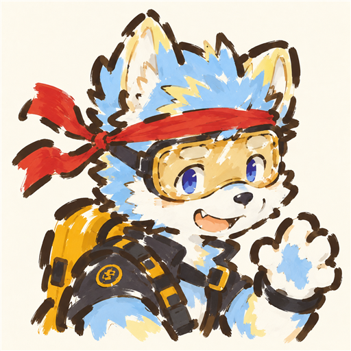

# 奶油粗笔涂鸦 · Cream Brush Doodle

上传自己的角色图片，生成奶油白底、深褐粗笔断线、露底平涂的可爱手绘插画。

这是一个可复用的 Codex skill，包含风格提示词、参考图和角色保真检查流程。适用于人物、动物和兽人 OC；它不包含训练模型或 LoRA。

## 效果参考



参考图用于传递画风。生成时应保留你上传角色的配色、物种、纹样和服装，不套用示例角色的蓝白毛色、红头带或装备。

## 安装

1. 点击本仓库的 **Code → Download ZIP** 并解压，或使用 Git 克隆：

   ```sh
   git clone https://github.com/CouCouYa/cream-brush-doodle.git
   ```

2. 将包含 `SKILL.md` 的整个文件夹命名为 `cream-brush-doodle`，放入 Codex 技能目录。默认位置为用户主目录下的 `.codex/skills`；如果设置了 `CODEX_HOME`，则放到该目录下的 `skills`。
3. 保留 `agents` 和 `references` 子文件夹。安装后的文件结构应为：

   ```text
   .codex/skills/cream-brush-doodle/
   ├── SKILL.md
   ├── agents/openai.yaml
   └── references/
       ├── prompt-template.md
       └── style-anchor.png
   ```

## 使用

在能发现该技能的 Codex 会话中上传角色图片，然后发送：

```text
使用 $cream-brush-doodle，把我上传的角色画成奶油粗笔涂鸦头像，保留原来的配色、纹样和标志性配件。
```

默认生成方形半身头像。也可以直接指定：

- **保留构图**：保留原图的动作和全身构图，只转换画风。
- **更松散**：用更少的大笔触，增加轮廓缺口和纸白露底。
- **仅要提示词**：根据我上传的角色整理提示词，暂时不生成图片。

宿主需要提供可用的图像生成能力。这个 skill 不提供模型额度、API 密钥或生成服务；具体工具的图片参考支持与生成效果可能不同。

## 不安装也能用

打开[中文提示词与英文画风块](references/prompt-template.md)，填写角色特征。将自己的角色图作为第一张图，将本仓库的[风格参考图](references/style-anchor.png)作为第二张图，交给支持多图参考的生成工具。

明确两张图的用途：**第一张决定角色，第二张只决定画风。**

## 文件说明

| 文件 | 用途 |
| --- | --- |
| [SKILL.md](SKILL.md) | 技能入口、角色保真规则与生成流程 |
| [agents/openai.yaml](agents/openai.yaml) | 技能名称和默认调用语句 |
| [references/prompt-template.md](references/prompt-template.md) | 可复制的中文模板和英文画风描述 |
| [references/style-anchor.png](references/style-anchor.png) | 经创作者认可的 AI 生成风格参考图 |

## 验证情况

技能格式已通过校验，并已用另一张橘白咖啡店角色图片实际生成过新图。不同输入仍会产生自然变化，不能保证每次完全一致。

仓库中的示例图为 AI 生成效果图，作为风格参考随技能分享；不包含原始 OC 插画或其他收集的原画。
